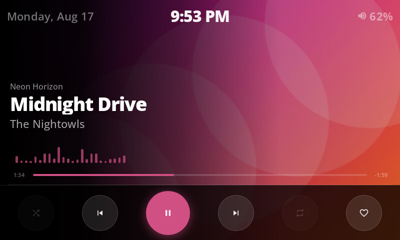
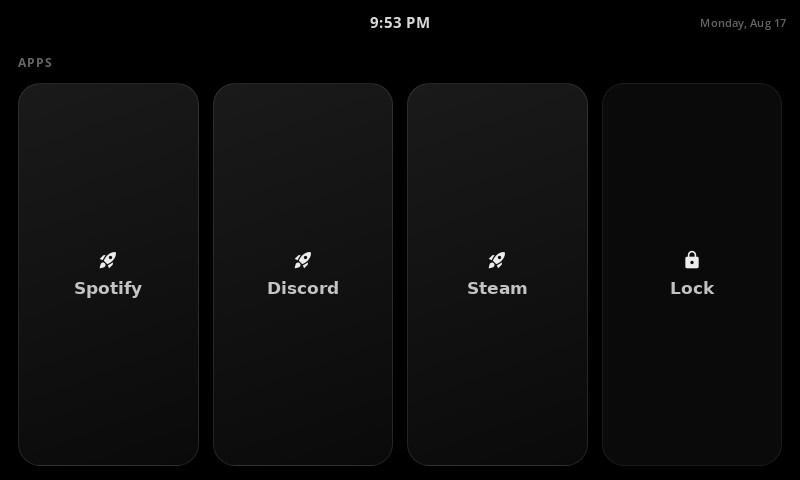
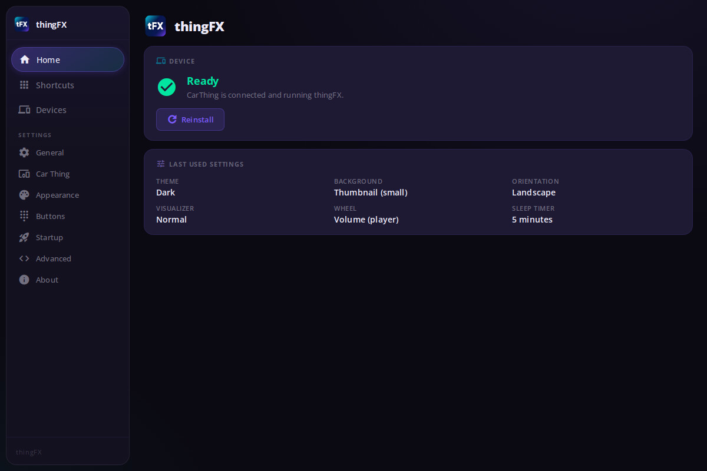
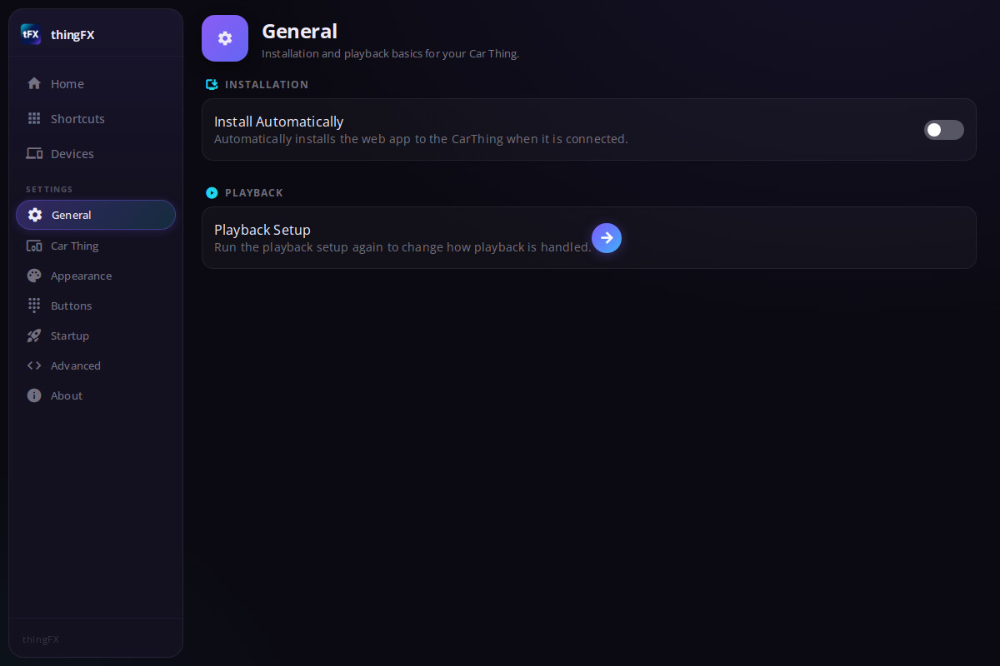
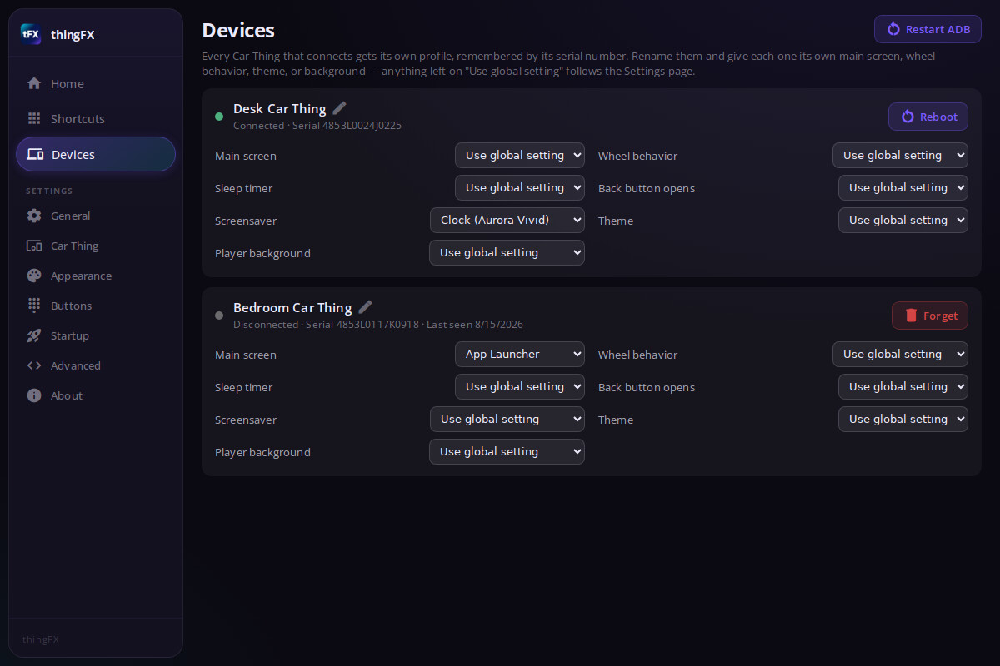

<div align="center">


# thingFX

**Give your Spotify Car Thing a second life.**

thingFX turns the discontinued Spotify Car Thing into a beautiful desktop companion — a now-playing display, media remote, and app launcher that sits right on your desk.



</div>

---

## What it does

thingFX has two parts:

- **The companion app** — a Windows desktop app that finds your Car Thing, installs the client, streams playback info to it, and lets you configure everything.
- **The Car Thing client** — the interface that runs on the device itself: a full-screen now-playing view with album art, a music visualizer, an app launcher, and more.

## Features

🎵 **Now Playing** — album art backgrounds (full, thumbnail, or extra large), track info, seek bar, playback controls, and a music spectrum visualizer with automatic accent colors pulled from the album art.

🚀 **App Launcher** — launch apps on your PC straight from the Car Thing's touchscreen. Add regular programs or Microsoft Store apps as shortcuts with custom icons in the companion app, and optionally show a "Lock PC" tile.

🎛️ **Physical controls** — the dial controls the player volume, your system (Windows) volume, or seeking; the back button switches views; and each of the 4 top preset buttons can launch a shortcut, lock your PC, or shut it down.

🖥️ **Multiple Car Things** — connect more than one device at the same time. The Devices page shows every Car Thing that's ever connected, lets you rename, reboot, or forget them, and gives each device its own settings profile (main screen, wheel behavior, theme, and background) — so one can be a music controller while another is an app launcher.

🌙 **Sleep timer & screensavers** — the screen dims to a clock, aurora, or custom screensaver when nothing is playing and the device is idle, and wakes automatically when playback starts. Pick from Clock, Aurora, Aurora Vivid, or clock-free aurora styles — per device, if you like — and the Car Thing can also jump straight to the screensaver whenever you lock your PC.

🎨 **Themes & layout** — dark, light, glassy, and aero themes, landscape or portrait orientation, and a configurable main screen (Now Playing or App Launcher) with automatic return after inactivity.

⚡ **Quality of life** — auto-start with Windows, automatic device recovery after PC reboots, automatic client reinstall on reconnect, weather and a live volume readout in the status bar, and live-syncing settings (no reinstall needed for most changes) — all organized in a redesigned settings area with everything one click away in the sidebar.

## Screenshots

### Car Thing client

| Now Playing | App Launcher |
| --- | --- |
|  |  |

### Companion app

| Home | Settings |
| --- | --- |
|  |  |

| Devices |
| --- |
|  |

## Getting started

1. **Install** the companion app on Windows using the installer (`thingfx-*-setup.exe`).
2. **Connect** your Car Thing over USB and follow the in-app setup — thingFX flashes the client onto the device automatically.
3. **Play music** with any media player; the Car Thing shows what's playing via the native Windows media session.

When a new version of the client is available for the device, the Home screen shows an update notice — one click pushes it to the Car Thing.

## Development

```bash
cd thingfx
npm install          # dependencies (desktop app)
npm run dev          # run the desktop app in dev mode

cd client
npm install          # dependencies (Car Thing client)
npm run dev          # run the client in a browser
```

Build a Windows installer:

```bash
npm run build && npx electron-builder --win
```

The project structure:

| Path | Contents |
| --- | --- |
| `thingfx/src/main` | Electron main process — device handling (ADB), WebSocket server, playback, storage |
| `thingfx/src/renderer` | Companion app UI (React) |
| `thingfx/src/preload` | Electron preload bridge |
| `thingfx/client/` | The Car Thing client (React, built separately and flashed to the device) |

## Credits

Based on [LumiThing](https://github.com/1Vortexx/LumiThing) by 1Vortexx, which builds on [GlanceThing](https://github.com/BluDood/GlanceThing) by BluDood.

## License

See [LICENSE](thingfx/LICENSE).
